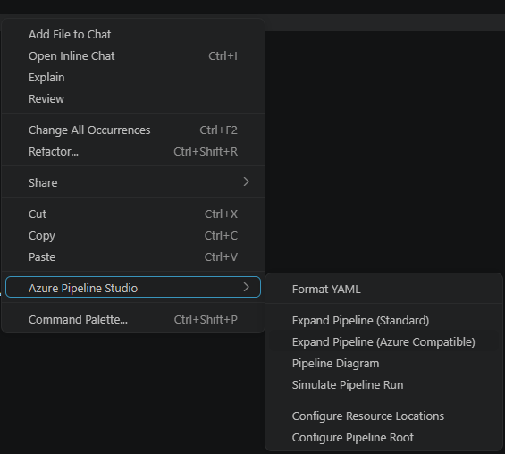
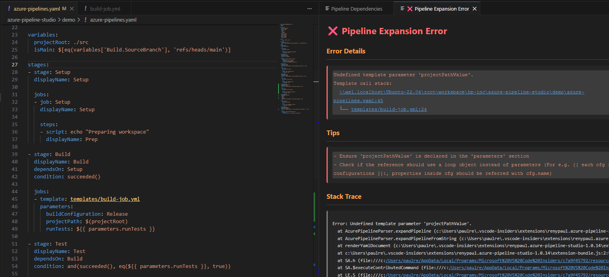
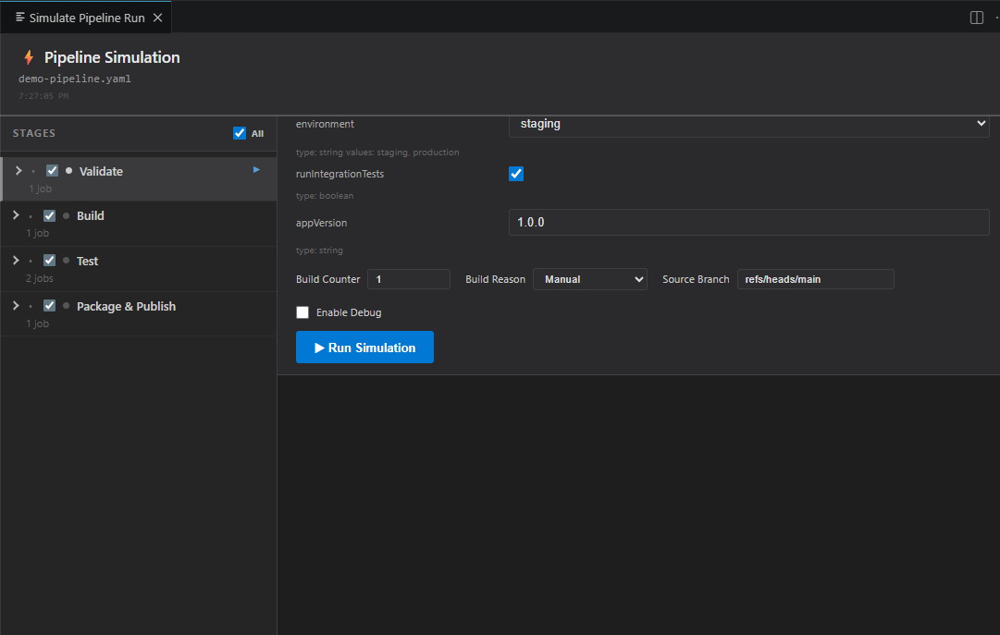
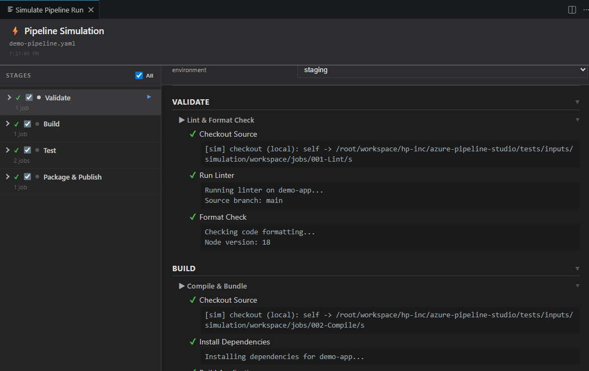
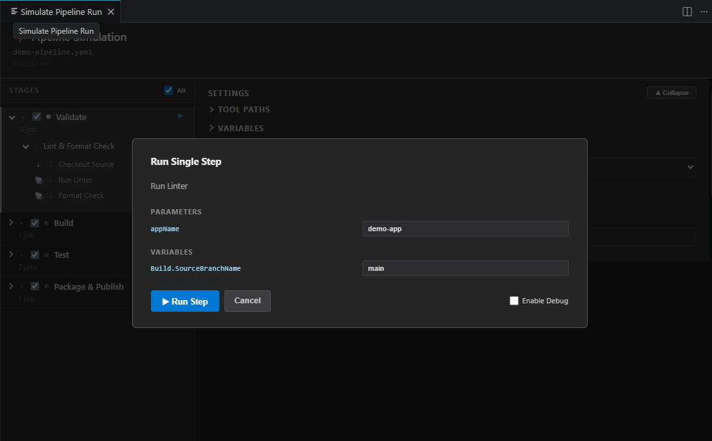

# Azure Pipeline Studio

VS Code extension and CLI tool for formatting and expanding Azure DevOps YAML pipelines with complete expression support.

## Context Menu


## Error Display


## Quick Start

### VS Code
1. Open a `.yml`/`.yaml` pipeline file
2. Right-click → **Azure Pipeline Studio** → **Format YAML** or **Expand Pipeline**
3. Configure repository paths via **Configure Resource Locations** if templates are referred in the pipeline
4. Use **Expand Pipeline (Azure Compatible)** for Azure DevOps-compatible output

### CLI
```bash
# Format file in-place
node extension-bundle.js pipeline.yml

# Format with options
node extension-bundle.js pipeline.yml -f indent=4 -f noArrayIndent=false

# Expand templates with variables
node extension-bundle.js pipeline.yml -x \
  -v "Build.Reason=Manual" \
  -v "Build.SourceBranch=refs/heads/main" \
  -o expanded.yml

# Recursive format
node extension-bundle.js -R ./pipelines -f indent=4

# With output file
node extension-bundle.js pipeline.yml -o formatted.yml

# Map repository templates
node extension-bundle.js pipeline.yml -x -r templates=../shared-templates
```

**Pre-commit Hook:**
```yaml
# .pre-commit-config.yaml
repos:
  - repo: https://github.com/HPInc/azure-pipeline-studio.git
    rev: v1.0.14
    hooks:
      - id: azure-pipeline-formatter
```

### Pre-commit
```bash
pip install pre-commit
pre-commit install
pre-commit run azure-pipeline-formatter --all-files
```

### Resource Locations

- `azurePipelineStudio.resourceLocations` - Array of repository mappings with `repository`, `location`, and optional match criteria (`name`, `endpoint`, `ref`, `type`)
- Use `@self` to reference templates in the current repository (for example `templates/build.yml@self`), resolving paths relative to the pipeline file's repository.

**Example `settings.json`:**
```json
{
  "azurePipelineStudio.resourceLocations": [
    {"repository": "templates", "location": "${workspaceFolder}/../shared"}
  ],
  "azurePipelineStudio.expansion.variables": {
    "Build.Reason": "Manual",
    "Build.SourceBranch": "refs/heads/main"
  }
}
```

## Features

- **Template Expansion**: Expand pipelines with shared templates and repository resources
- **Compile-Time Variables**: Set Azure Pipeline variables (Build.Reason, Build.SourceBranch, etc.) to test different build scenarios (see [docs/COMPILE_TIME_VARIABLES.md](docs/COMPILE_TIME_VARIABLES.md))
- **Pipeline Simulation**: Run pipeline scripts locally, step-by-step or full pipeline, directly from VS Code
- **Dependency Visualization**: Interactive stage/job dependency diagram — click any node to open its expanded YAML in an editor tab
- **Parameter Validation**: Automatic validation ensures all required template parameters are provided
- **Expression Evaluation**: All 33 Azure DevOps expression functions (`${{ }}`, `$[]`, `$()`)
- **Advanced Formatting**: Customizable indentation, line width, array formatting, native comment preservation
- **Modern YAML Parser**: Uses `yaml` package (v2.x) with full comment support
- **CLI & Pre-commit**: Batch processing, recursive formatting, git hook integration
- **Side-by-Side View**: Inspect rendered YAML while editing source
- **Repository Mapping**: Configure local paths for template resolution

## Commands

All commands are available via:
- Command Palette (`Ctrl+Shift+P` / `Cmd+Shift+P`)
- Right-click context menu → **Azure Pipeline Studio**

Available commands:
- **Format YAML** - Format the current file in-place
- **Expand Pipeline (Standard)** - Expand templates and expressions with user settings
- **Expand Pipeline (Azure Compatible)** - Expand with Azure DevOps-compatible formatting (literal blocks, capitalized booleans)
- **Pipeline Diagram** - Analyze and display pipeline dependencies (stages, jobs, templates, resources)
- **Simulate Pipeline Run** - Open the simulation panel to run pipeline scripts locally
- **Configure Resource Locations** - Set up repository paths for if templates are referred in the pipeline

## Pipeline Diagram

Open with **Right-click → Azure Pipeline Studio → Pipeline Diagram** (or the Command Palette).

The diagram renders an interactive dependency graph of your pipeline using [Mermaid](https://mermaid.js.org/):

- **Stages** are shown as top-level nodes with arrows indicating `dependsOn` relationships
- **Jobs** within each stage are shown as child nodes, also with their dependency edges
- **Templates and resources** referenced by the pipeline are listed alongside the graph

**Click to open YAML**: Clicking any stage or job node in the diagram opens its expanded YAML in a new editor tab. Clicking the same node again reuses that tab rather than opening a new one, keeping your workspace tidy.

## Pipeline Simulation

Simulate Pipeline Run executes your pipeline's bash/PowerShell scripts locally so you can verify logic, environment variables, and template output without pushing to Azure DevOps.

Open with **Right-click → Azure Pipeline Studio → Simulate Pipeline Run** (or the Command Palette).

### Simulation Panel



The panel has two areas:

**Left sidebar — Stages & Steps**
- Lists every stage with its jobs and steps, mirroring the expanded pipeline structure
- Check/uncheck individual stages to include or exclude them from the run
- Click the **▶** play button on any step to open the [Run Single Step](#run-single-step) modal
- After a run, each stage/job/step shows a **✔ passed**, **✖ failed**, or **⧘ skipped** icon

**Right panel — Settings**
- **Top-level parameters**: If the pipeline defines `parameters:`, each one appears here with its type (string, boolean, dropdown) and default value
- **Build Counter** / **Build Reason** / **Source Branch**: Standard Azure DevOps variables injected into every run
- **Enable Debug**: Enables `set -x` (bash) or `Set-PSDebug` (PowerShell) in every script and merges stderr into the output for full trace logging
- **Run Simulation** button: Executes all checked stages in order

> **Simulation directory**: Scripts run with working paths rooted at a `simulation/` folder next to your pipeline file. Agent variables (`Build.SourcesDirectory`, `Agent.BuildDirectory`, etc.) are set to subdirectories within that folder to mirror real ADO agent layouts.

### Full Run Results



After **Run Simulation**, the results panel shows each stage and job collapsed by default. Expand any node to see:
- Per-step pass/fail icon
- Script stdout (and stderr when debug is enabled)
- Output variables set by `##vso[task.setvariable ...]` commands

The sidebar also updates with pass/fail icons at every level.

### Run Single Step



Click the **▶** play button next to any step in the sidebar to run just that step in isolation.

The **Run Single Step** modal shows:

| Section | Contents |
|---|---|
| **Parameters** | Compile-time template parameters the step was expanded from, pre-filled with their current expanded values. Changing a value substitutes it into the script before execution. |
| **Variables** | Runtime `$(VAR)` references used in the script, pre-filled from saved overrides and agent defaults. |
| **Enable Debug** | Per-step debug toggle independent of the main panel setting. |

Click **▶ Run Step** to execute only that step. Results appear in the main panel, narrowed to that step.

### Variables & Overrides

Variable values used during simulation are resolved in priority order (highest wins):

1. Values entered in the modal / Settings panel
2. Saved overrides (persisted per workspace)
3. Settings panel Build Counter / Build Reason / Source Branch controls
4. Agent defaults derived from the simulation directory layout

Saved overrides persist across VS Code sessions and are restored when you reopen the simulation panel.

### Simulation Settings

Configure simulation behaviour via VS Code settings:

- `azurePipelineStudio.simulation.workingDirectory` — Override the root directory used as the simulated workspace (default: directory of the open pipeline file)
- `azurePipelineStudio.simulation.toolPaths` — Map tool names to explicit executable paths, e.g. `{"bash": "/usr/bin/bash", "pwsh": "/snap/bin/pwsh"}`
- `azurePipelineStudio.simulation.toolsDirectory` — Path to a folder containing tool executables (checked before PATH when resolving tools not listed in `toolPaths`)

### Use Cases

#### Unit-testing pipeline steps locally

Simulation lets you treat each pipeline step as a testable unit — run it in isolation with controlled inputs and assert on the output, all without a real ADO agent.

**Typical workflow:**
1. Open your pipeline file and launch **Simulate Pipeline Run**.
2. Expand **Variables** and set any `$(VAR)` values the step depends on (e.g. a service token, branch name, or build counter). Click **Save** to persist them.
3. Click **▶** next to the step under test in the sidebar to open the **Run Single Step** modal.
4. Adjust individual parameter or variable overrides in the modal as needed.
5. Click **▶ Run Step** and inspect stdout/stderr inline.
6. Iterate: change variable values or script logic, re-run, confirm the output matches expectations.

Because saved overrides persist across VS Code sessions, you can maintain a stable set of test inputs per pipeline and re-run quickly after any change.

#### Debugging script failures before pushing

Enable **Enable Debug** (panel-wide or per-step in the modal) to prepend `set -x` to bash scripts and `Set-PSDebug -Trace 1` to PowerShell scripts. The full command trace appears inline so you can pinpoint exactly which line failed and what values were in scope.

#### Validating template parameter wiring

Run the full simulation with different **Top-Level Parameters** values to confirm conditional steps are included/excluded correctly and that template parameters flow through to the right scripts.

#### Smoke-testing tool availability

Set **Tools Folder Path** (or individual entries in **Individual Tool Paths**) to point at local installs of `jq`, `curl`, `aws`, or any other CLI the pipeline relies on. Running the simulation confirms the tools are resolvable and the commands work with your actual data before CI runs them.

## Configuration

### Formatting Options

Configure YAML formatting via VS Code settings (File → Preferences → Settings):

- `azurePipelineStudio.format.indent` - Number of spaces for indentation, 1-8 (default: `2`)
- `azurePipelineStudio.format.lineWidth` - Preferred line width, 0 to disable wrapping (default: `0`)
- `azurePipelineStudio.format.noArrayIndent` - Remove indentation for array items (default: `true`)
- `azurePipelineStudio.format.stepSpacing` - Add blank lines between steps/stages/jobs (default: `true`)
- `azurePipelineStudio.format.firstBlockBlankLines` - Blank lines before main sections (steps/stages/jobs), 0-4 (default: `2`)
- `azurePipelineStudio.format.blankLinesBetweenSections` - Blank lines between root sections (trigger/variables/resources/etc), 0-4 (default: `1`)
- `azurePipelineStudio.format.forceQuotes` - Force double quotes on all strings (default: `false`)
- `azurePipelineStudio.format.sortKeys` - Sort object keys alphabetically (default: `false`)
- `azurePipelineStudio.format.azureCompatible` - Use Azure DevOps-compatible formatting: literal block scalars (|), capitalized booleans, trailing blank lines (default: `false`)
- `azurePipelineStudio.refreshOnSave` - Auto-refresh rendered YAML view when source file is saved (default: `true`)

### Expansion Options

- `azurePipelineStudio.expansion.expandTemplates` - Enable/disable template expansion (default: `true`)
- `azurePipelineStudio.expansion.variables` - Map of variable names to values for expression evaluation (default: `{}`)

## Command Line Interface

Format and expand pipelines from the command line:

### CLI Options

**Help:**
- `-h, --help` - Show help message

**Output:**
- `-o, --output <file>` - Write to output file (only with single input file)

**Repository mapping:**
- `-r, --repo <alias=path>` - Map repository alias to local directory

**Format options:**
- `-f, --format-option <key=value>` - Set format option (can be repeated)
  - `indent=<1-8>` - Indentation spaces (default: 2)
  - `noArrayIndent=<true|false>` - Remove array indentation (default: true)
  - `lineWidth=<number>` - Line width, 0 to disable (default: 0)
  - `stepSpacing=<true|false>` - Blank lines between steps/stages/jobs (default: true)
  - `firstBlockBlankLines=<0-4>` - Blank lines before main sections (default: 2)
  - `blankLinesBetweenSections=<0-4>` - Blank lines between root sections (default: 1)
  - `forceQuotes=<true|false>` - Force quotes on strings (default: false)
  - `sortKeys=<true|false>` - Sort object keys (default: false)

**Recursive formatting:**
- `-R, --format-recursive <path>` - Format all files in directory tree
- `-e, --extension <ext>` - File extensions to format (default: .yml, .yaml)

### Examples

```bash
# Show help
node extension-bundle.js -h

# Format with 4-space indentation
node extension-bundle.js pipeline.yml -f indent=4

# Multiple format options
node extension-bundle.js pipeline.yml -f indent=4 -f noArrayIndent=false -f lineWidth=120

# Expand with repository mapping
node extension-bundle.js azure-pipelines.yml -r templates=../shared-templates -o expanded.yml

# Format recursively with custom options
node extension-bundle.js -R ./pipelines -f indent=4 -f stepSpacing=false

# Include additional file types
node extension-bundle.js -R ./ci -e .azure -e .ado

# Format multiple files at once
node extension-bundle.js file1.yml file2.yml file3.yml -f indent=4
```

### Script Commands

The CLI exposes script-level commands for inspecting and executing individual pipeline steps — useful for automated testing, CI validation, or debugging a single step without a full simulation.

#### Discover pipeline structure

```bash
# List all stages
node extension-bundle.js liststages ./pipeline.yaml

# List jobs within stage 1
node extension-bundle.js listjobs -stage 1 ./pipeline.yaml

# List steps within stage 1, job 1
node extension-bundle.js liststeps -stage 1 -job 1 ./pipeline.yaml

# List everything in one shot
node extension-bundle.js listpipeline ./pipeline.yaml
```

#### Inspect a step's inputs

```bash
# Show template parameters, runtime variables, and environment for step 3
node extension-bundle.js getscriptinfo -stage 1 -job 1 -step 3 ./pipeline.yaml
```

Output includes parameter names, types, default values, and current expanded values.

#### `runscript` — execute a step

```bash
node extension-bundle.js runscript -stage N -job N -step N <file> [--input JSON] [--debug] [--verbose]
```

Runs the script for a single pipeline step with optional overrides. By default only script stdout is printed; `--verbose` prints full JSON with step info, inputs, and environment.

| Option | Description |
|---|---|
| `-stage N` | 1-based stage index |
| `-job N` | 1-based job index |
| `-step N` | 1-based step index |
| `--input JSON` | JSON object with `parameters` and/or `variables` overrides |
| `--debug` | Set `System.Debug=true` and prepend `set -x` |
| `--xtrace` / `-x` | Prepend `set -x` only (no `System.Debug`) |
| `--verbose` | Print full JSON result instead of script output only |

**`--input` keys:**
- `parameters` — map of template parameter name → value
- `variables` — map of variable name → value; keys matching `Build.*`, `System.*`, `Agent.*`, `Pipeline.*`, `variables.*` are treated as compile-time; all others as runtime

```bash
# Run with default values
node extension-bundle.js runscript -stage 1 -job 1 -step 3 ./pipeline.yaml

# Override a template parameter
node extension-bundle.js runscript -stage 1 -job 1 -step 3 ./pipeline.yaml \
  --input '{"parameters":{"username":"myuser"}}'

# Override a runtime variable
node extension-bundle.js runscript -stage 1 -job 1 -step 3 ./pipeline.yaml \
  --input '{"variables":{"auth_token":"mytoken"}}'

# Enable debug mode
node extension-bundle.js runscript -stage 1 -job 1 -step 3 ./pipeline.yaml \
  --input '{"variables":{"System.Debug":"true"}}'

# Combine overrides
node extension-bundle.js runscript -stage 1 -job 1 -step 3 ./pipeline.yaml \
  --input '{"parameters":{"serviceUser":"myuser"},"variables":{"System.Debug":"true","variable.var1":"abc"}}'
```

#### Use `runscript` for unit testing

`runscript` is designed to be called from test scripts or CI jobs to validate individual steps automatically:

```bash
#!/usr/bin/env bash
# test-step.sh — assert a step produces expected output
OUTPUT=$(node extension-bundle.js runscript -stage 1 -job 1 -step 2 ./pipeline.yaml \
  --input '{"parameters":{"environment":"staging"},"variables":{"Build.Reason":"Manual"}}')

if echo "$OUTPUT" | grep -q "Deployment target: staging"; then
  echo "PASS"
else
  echo "FAIL: unexpected output"
  echo "$OUTPUT"
  exit 1
fi
```

Combined with `listpipeline` to enumerate steps, you can build a full test matrix that exercises every step in the pipeline with different input combinations.

## Pre-commit Hook

Automatically format YAML files before commit. Uses 282KB standalone bundle with auto Node.js installation.

**Setup:**
```yaml
# .pre-commit-config.yaml
repos:
  - repo: https://github.com/HPInc/azure-pipeline-studio.git
    rev: v1.0.14
    hooks:
      - id: azure-pipeline-formatter
        args: [-R, ., -f, indent=4]  # Optional: customize format
```

**Install:**
```bash
pip install pre-commit && pre-commit install
pre-commit run azure-pipeline-formatter --all-files
```

## Expression Support

Complete support for all 33 Azure DevOps expression functions across compile-time (`${{ }}`), runtime (`$[]`), and variable (`$()`) expressions.

**Function Categories:**
- **Comparison** (6): `eq`, `ne`, `gt`, `ge`, `lt`, `le`
- **Logical** (4): `and`, `or`, `not`, `xor`
- **Containment** (5): `coalesce`, `contains`, `containsValue`, `in`, `notIn`
- **String** (10): `lower`, `upper`, `startsWith`, `endsWith`, `trim`, `replace`, `split`, `join`, `format`, `length`
- **Conversion** (3): `convertToJson`, `counter`, `iif`
- **Job Status** (5): `always`, `canceled`, `failed`, `succeeded`, `succeededOrFailed`

See [Microsoft's Expression Documentation](https://learn.microsoft.com/en-us/azure/devops/pipelines/process/expressions) for details.

## File Directives

Control formatting per file using special comments in the first 5 lines:

**Disable formatting:**
```yaml
# aps-format=false
```

**Custom options:**
```yaml
# aps-format indent=4,lineWidth=120,newline=\r\n
```

**Supported Options:**
- `indent` - Spaces per level (1-8)
- `lineWidth` - Max line width (0 to disable)
- `newline` - Line ending (`\n`, `\r\n`, or `crlf`)
- `noArrayIndent` - Remove array indentation (`true`/`false`)
- `stepSpacing` - Add blank lines between steps/stages/jobs (`true`/`false`)
- `sectionSpacing` - Enable section spacing (uses blankLinesBetweenSections) (`true`/`false`)
- `forceQuotes` - Force double quotes on all strings (`true`/`false`)
- `sortKeys` - Sort object keys alphabetically (`true`/`false`)
- `preserveComments` - Keep inline comments (`true`/`false`)
- `normalizePaths` - Normalize file paths (`true`/`false`)
- `expandTemplates` - Expand template files (`true`/`false`)

**Rules:**
- Must appear in first 5 lines
- One directive per file (first match wins)
- Options are comma-separated with no spaces around `=`
- Use escape sequences for newlines: `\n`, `\r\n`, `\r`

**Note:** `firstBlockBlankLines` and `blankLinesBetweenSections` are only available in VS Code settings and CLI, not in file directives. Use `sectionSpacing=true` in file directives to enable section spacing with default values.

## Testing

Run the comprehensive test suite:

```bash
npm test              # Run all tests
```

**Test Coverage:** 74 tests covering YAML parsing, formatting, expressions, Azure compatibility, and edge cases.

See [docs/TESTING.md](docs/TESTING.md) for detailed documentation.

## Requirements

- **VS Code**: 1.64 or newer
- **Node.js**: Required for CLI usage (version 14+)

## Known Limitations

- Runtime expressions (`$[]`) are recognized but not evaluated
- Some advanced Azure DevOps features may not be fully supported

## Contributing

Issues and pull requests are welcome! Please report any bugs or feature requests on the GitHub repository.

## License

MIT

## Credits

Built with:
- [yaml](https://github.com/eemeli/yaml) - Modern YAML parser with comment preservation
- [jsep](https://github.com/EricSmekens/jsep) - JavaScript expression parser
- [mermaid](https://mermaid.js.org/) - Diagramming and charting tool
